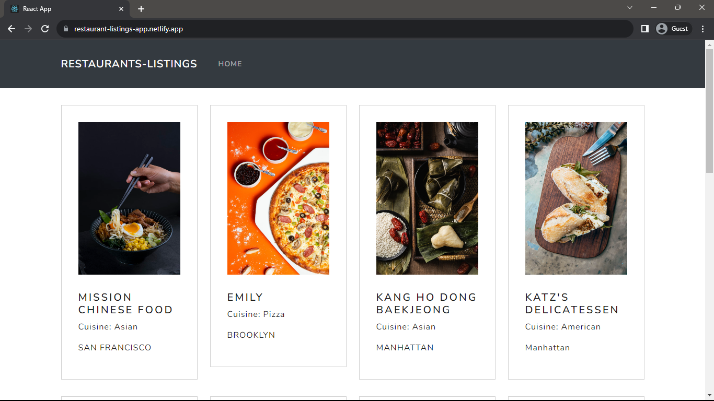
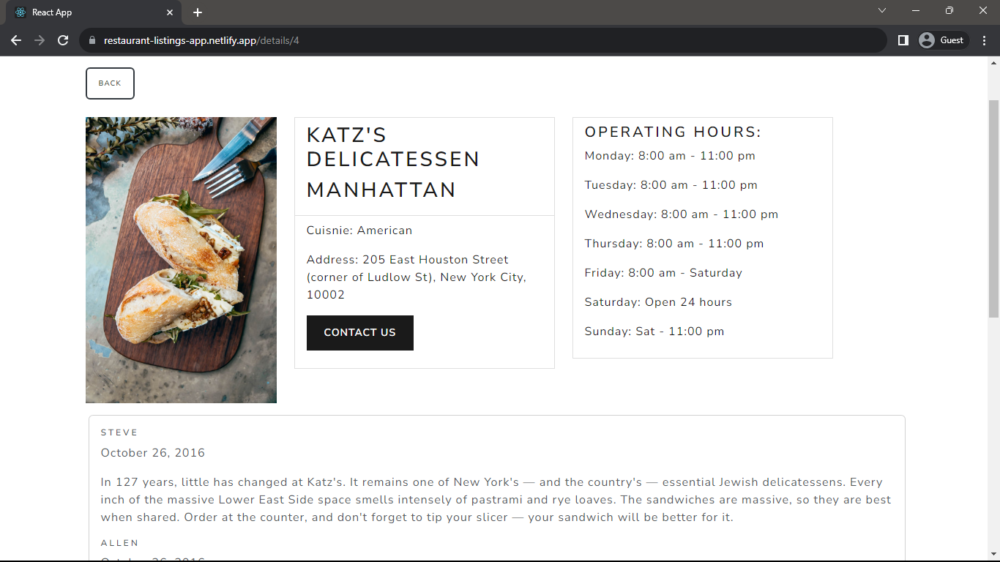
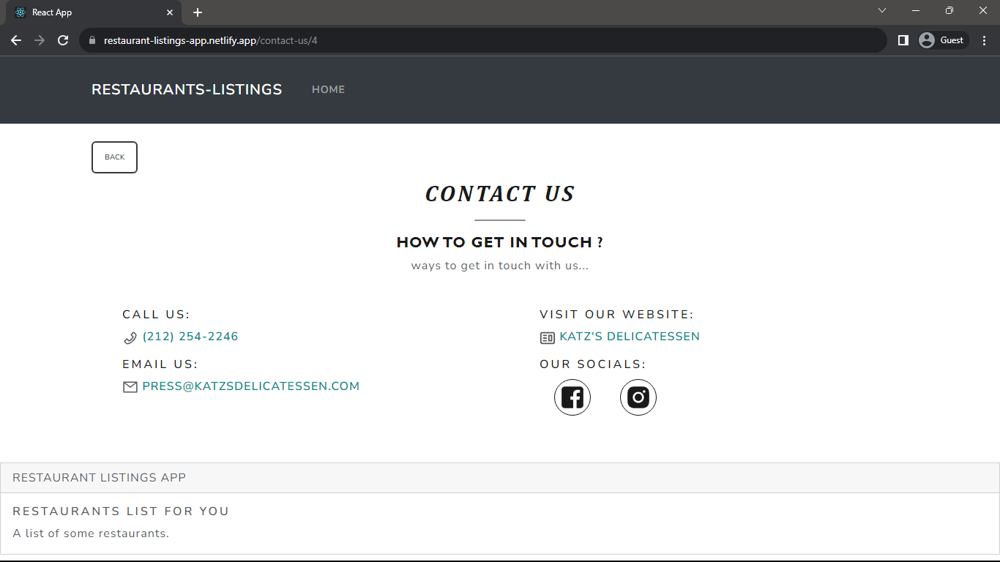

 <h1 align="center">Restaurant Listing Website</h1>

<h3>Project Description</h3>

Developed a restaurant viewing application using React, focused on providing users with the ability to explore a curated list of restaurants sourced from a JSON file. The project is designed for a straightforward user experience, allowing users to view restaurant details without the need for additional interactions. Implemented Redux for streamlined state management, ensuring efficient data handling while maintaining a clean and minimalist user interface. This project demonstrates the power of React for creating a user-friendly application with the specific goal of allowing users to effortlessly browse and view restaurant information.

